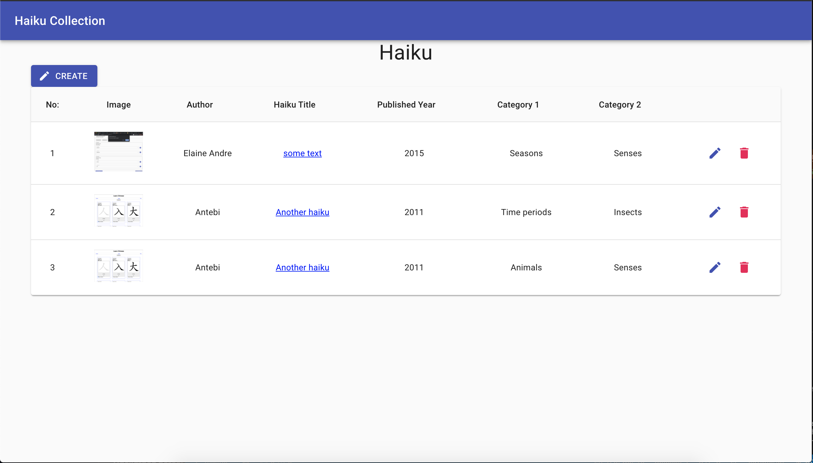

# Haiku Web Application

    An application for haiku lovers to keep records of their favorite haiku.

## Steps:

For Haiku Admin
<ol>
    <li>
        Clone the repository in htdocs (if using XAMPP)
    </li>
    <li>
        Make sure XAMPP is running and sqlite3 is available
    </li>
    <li>
    Create db in backend (name: haiku.db) 
	Command Line Commands:
        <ul>
            <li>cd backend</li>
            <li>sqlite3</li>
            <li>.open haiku.db</li>
            <li>.read sql_files/Create.sql</li>
            <li>.read sql_files/Insert.sql</li>
            <li>.tables (to check if the database has been created successfully)</li> 
        </ul>
    </li>
    <li>
        Make sure there is read & write privilege for the whole folder and files inside it (especially haiku.db)
    </li>
    <li>
        cd frontend
    </li>
    <li>
        Create .env file inside frontend folder
    </li>
    <li>
        put 
        "REACT_APP_SERVER_URL=http://localhost/haiku/backend/api" (without quotation) 
        in .env file
    </li>
    <li>
        "npm install" for installing dependencies.
    </li>
    <li>
        "npm start" (for development server for React)
    </li>
</ol>

For Haiku Demo
<ol>
    <li>
        Make sure there is read & write privilege for the whole folder and files inside it (especially haiku.db)
    </li>
    <li>
        cd frontend (inside demo folder)
    </li>
    <li>
        Create .env file inside frontend folder
    </li>
    <li>
        put 
        "REACT_APP_SERVER_URL=http://localhost/haiku/demo/backend/api" (without quotation) 
        in .env file
    </li>
    <li>
        "npm install" for installing dependencies.
    </li>
    <li>
        "npm start" (for development server for React)
    </li>
</ol>

## Tech Stack

<ul>
    <li>ReactJS</li>
    <li>Material UI</li>
    <li>PHP</li>
    <li>SQLite</li>
</ul>

